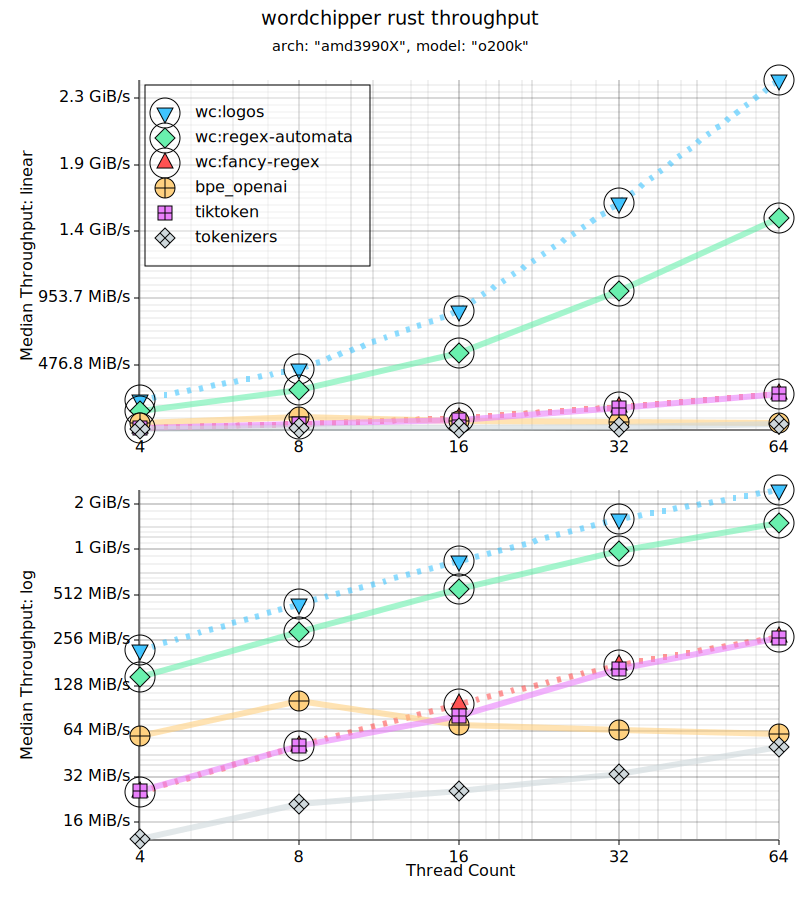
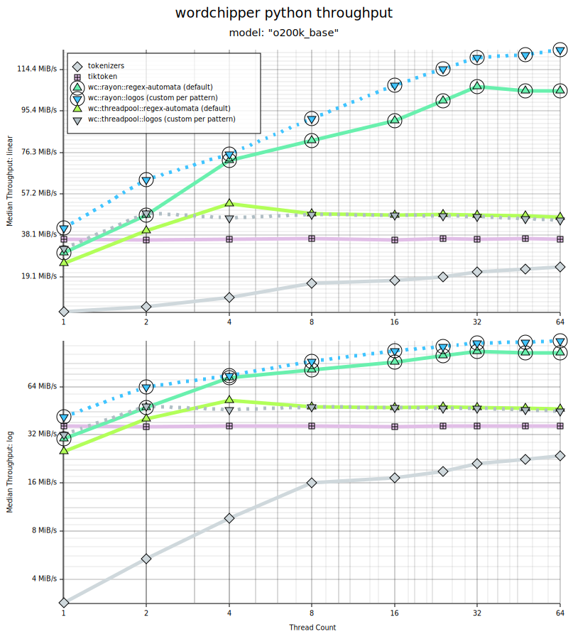

[](https://crates.io/crates/wordchipper)
[](https://docs.rs/wordchipper/latest/wordchipper/)
[](https://github.com/zspacelabs/wordchipper/actions/workflows/ci.yml)
[](LICENSE)

[](https://discord.gg/vBgXHWCeah)
[](https://deepwiki.com/zspacelabs/wordchipper)

ZSpaceLabs:

* [zspacelabs.ai](https://zspacelabs.ai)

`wordchipper` is a high-performance Rust byte-pair encoder tokenizer for the OpenAI GPT-2 tokenizer
family. Through a
combination of strict allocation discipline, factoring along the implementation lines of the
pre-tokenization and BPE
merge algorithm choices, thread-local resources, and extensive metrics; we were able to achieve
throughput speedups
relative to [tiktoken-rs](https://github.com/zurawiki/tiktoken-rs) in rust on a 64 core machine of ~
4.3-5.7x
(4 to 64 cores) for general regex BPE vocabularies, and ~6.9x-9.2x when using custom DFA lexers for
specific OpenAI
vocabularies. Under python wrappers, we see a range of ~2x-4x (4 to 64 cores) speedups
over [tiktoken](https://github.com/openai/tiktoken). The substitutable design yields a benchmark
cross-product that
reveals workload-dependent encoder selection and corpus-modulated performance inversion between
algorithm families.

## Status

The productionization towards an LTR stable release can be
tracked in the [Alpha Release Tracking Issue](https://github.com/zspacelabs/wordchipper/issues/2).

## Encode/Decode Side-by-Side Benchmarks

<div style="text-align:center">
<a href="benchmarks/amd3990X/plots/rust_parallel/wc_logos_vrs_brandx.rust.o200k.svg">

</a>
<a href="benchmarks/amd3990X/plots/python_parallel/wc_vrs_brandx.py.o200k_base.svg">

</a>
</div>

## `no_std` Support

The core tokenization pipeline (spanning, encoding, decoding, vocabulary lookup) works in `no_std`
environments. This is CI-verified against `wasm32-unknown-unknown` and `thumbv7m-none-eabi` targets.

```toml
[dependencies]
wordchipper = { version = "0.7", default-features = false }
```

Features that require `std` (training, file I/O, download, rayon parallelism) are behind
feature flags that imply `std`.

## Language Bindings

### Python

```bash
pip install wordchipper
```

```python
from wordchipper import Tokenizer

tok = Tokenizer.from_pretrained("cl100k_base")
tokens = tok.encode("hello world")  # [15339, 1917]
text = tok.decode(tokens)  # "hello world"
```

See [bindings/python](bindings/python) for full API and benchmarks.

### JavaScript / TypeScript (WASM)

```js
import {Tokenizer} from "./js/dist/index.js";

const tok = await Tokenizer.fromPretrained("o200k_base");
const tokens = tok.encode("hello world"); // Uint32Array
const text = tok.decode(tokens);          // "hello world"
```

See [bindings/wasm](bindings/wasm) for full API, build instructions, and examples.

## Components

### Published Crates

- [wordchipper](crates/wordchipper) - main crate.
- [wordchipper-training](crates/wordchipper-training) - training library.
- [wordchipper-cli](crates/wordchipper-cli) - `chipper` multifunction command-line tool.

#### Internally Sourced Dep Crates

You should never need to import these directly.

- [wordchipper-disk-cache](crates/wordchipper-disk-cache) - disk cache.

### Bindings

- [wordchipper-python](bindings/python) - Python bindings (PyO3/maturin)
- [wordchipper-wasm](bindings/wasm) - WASM bindings (wasm-bindgen) with TypeScript wrapper

### Development Crates

A Number of internal crates are used for development.

- [dev-crates](dev-crates)

## Acknowledgements

* Thank you to [@karpathy](https://github.com/karpathy)
  and [nanochat](https://github.com/karpathy/nanochat)
  for the work on `rustbpe`.
* Thank you to [tiktoken](https://github.com/openai/tiktoken) for their initial work in the rust
  tokenizer space.

