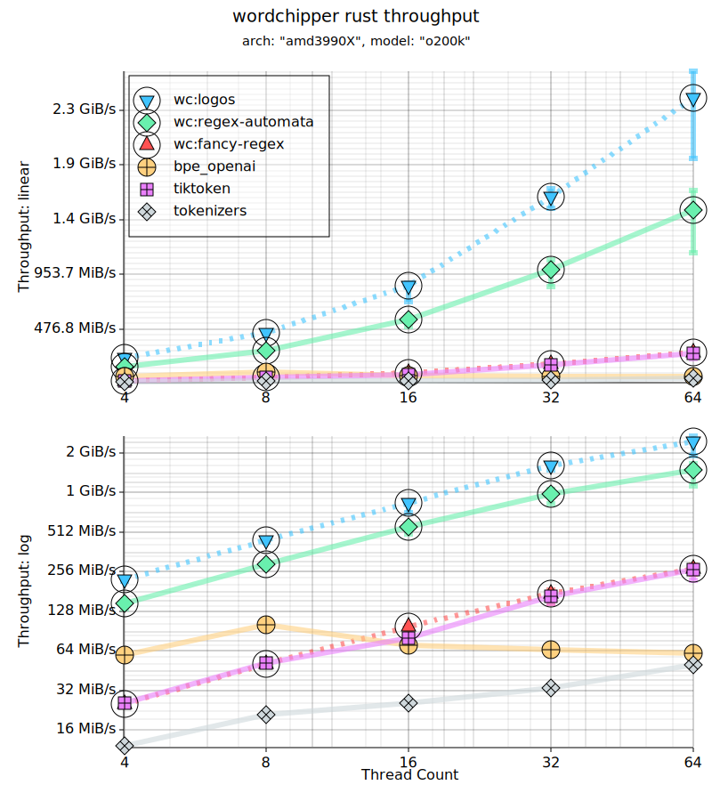
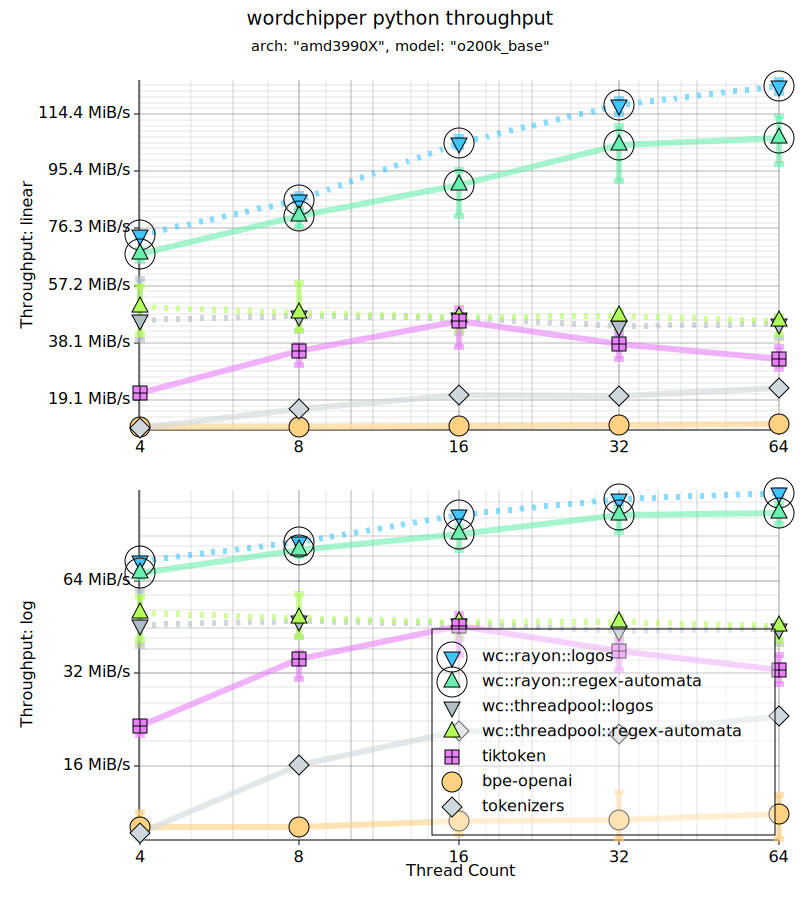

# wordchipper - HPC Rust BPE Tokenizer


[](https://crates.io/crates/wordchipper)
[](https://docs.rs/wordchipper/latest/wordchipper/)
[](https://github.com/zspacelabs/wordchipper/actions/workflows/ci.yml)

[](https://discord.gg/vBgXHWCeah)
[](https://deepwiki.com/zspacelabs/wordchipper)

## Overview

`wordchipper` is a high-performance Rust byte-pair encoder tokenizer for the OpenAI GPT-2 tokenizer
family. It achieves throughput speedups relative to [tiktoken-rs](https://github.com/zurawiki/tiktoken-rs)
in rust on a 64 core machine of ~4.3-5.7x (4 to 64 cores) for general regex BPE vocabularies,
and ~6.9x-9.2x when using custom DFA lexers for specific OpenAI vocabularies.
Under python wrappers, we see a range of ~2x-4x (4 to 64 cores) speedups over
[tiktoken](https://github.com/openai/tiktoken).

### Suite Crates

This is the main crate for the [wordchipper](https://github.com/zspacelabs/wordchipper) project.

The core additional user-facing crates are:

* [wordchipper-cli](https://crates.io/crates/wordchipper-cli) - a multi-tool tokenizer binary;
  notably:
    * `wordchipper-cli cat` - in-line encoder/decoder tool.
    * `wordchipper-cli train` - tokenizer training tool.
* [wordchipper-training](https://crates.io/crates/wordchipper-training) - an extension crate for
  training tokenizers.

## Encode/Decode Side-by-Side Benchmarks

<div style="text-align:center">

<a href="assets/wc_logos_vrs_brandx.rust.o200k.svg">

</a>
<a href="assets/wc_vrs_brandx.py.o200k_base.svg">

</a>
<br/>
</div>

| x 64 Core         | r50k rust   | gpt2 python | o200k rust  | o200k python |
|-------------------|-------------|-------------|-------------|--------------|
| wordchipper:logos | 2.7 GiB/s   | 114.1 MiB/s | 2.4 GiB/s   | 123.7 MiB/s  |
| wordchipper       | 1.7 GiB/s   | 110.5 MiB/s | 1.5 GiB/s   | 106.5 MiB/s  |
| tiktoken*         | 386.0 MiB/s | 25.5 MiB/s  | 265.2 MiB/s | 32.7 MiB/s   |
| bpe-openai        |             |             | 60.9 MiB/s  | 11.1 MiB/s   |
| tokenizers        | 49.7 MiB/s  | 20.8 MiB/s  | 50.2 MiB/s  | 23.2 MiB/s   |

Read the full performance paper:

* [wordchipper: Fast BPE Tokenization with Substitutable Internals](https://zspacelabs.ai/wordchipper/articles/substitutable/)

## Client Usage

### Pretrained Vocabularies

* [OpenAI OATokenizer](https://docs.rs/wordchipper/latest/wordchipper/pretrained/openai/enum.OATokenizer.html)

### Encoders and Decoders

* [Token Encoders](https://docs.rs/wordchipper/latest/wordchipper/encoders/index.html)
* [Token Decoders](https://docs.rs/wordchipper/latest/wordchipper/decoders/index.html)

## Loading Pretrained Models

Loading a pre-trained model requires reading the vocabulary,
as well as configuring the spanning (regex and special words)
configuration.

For a number of pretrained models, simplified constructors are
available to download, cache, and load the vocabulary.

See: [wordchipper::get_model](
https://docs.rs/wordchipper/latest/wordchipper/fn.get_model.html)

```rust,no_run
use std::sync::Arc;

use wordchipper::{
    get_model,
    TokenDecoder,
    TokenEncoder,
    UnifiedTokenVocab,
    disk_cache::WordchipperDiskCache,
};

fn example() -> wordchipper::errors::Result<(Arc<dyn TokenEncoder<u32>>, Arc<dyn TokenDecoder<u32>>)> {
    let mut disk_cache = WordchipperDiskCache::default();
    let vocab: UnifiedTokenVocab<u32> = get_model("openai/o200k_harmony", &mut disk_cache)?;

    let encoder = vocab.to_default_encoder();
    let decoder = vocab.to_default_decoder();

    Ok((encoder, decoder))
}
```

## Acknowledgements

* Thank you to [@karpathy](https://github.com/karpathy)
  and [nanochat](https://github.com/karpathy/nanochat)
  for the work on `rustbpe`.
* Thank you to [tiktoken](https://github.com/openai/tiktoken) for their initial work in the rust
  tokenizer space.

